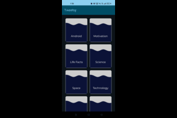
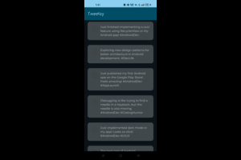

# Tweets Curator App with MVVM Pattern using Jetpack Compose

The Tweets Curator App is a simple Android application that demonstrates the basics of the Model-View-ViewModel (MVVM) architecture with Jetpack Compose. It allows users to curate tweets based on categories fetched from a JSON API hosted on JSONBin.io. Key features include ViewModel integration with HILT, navigation using Navigation Component, and handling loading states with StateFlows.

## Features

- MVVM Architecture with Jetpack Compose
- HILT Integration for Dependency Injection
- Navigation Component for App Navigation
- StateFlow for Data Observing
- Retrofit Integration for API Calls

## Screenshots

## Dependencies

- Kotlin
- Jetpack Compose
- HILT
- Navigation Component
- Retrofit
- Coroutines

